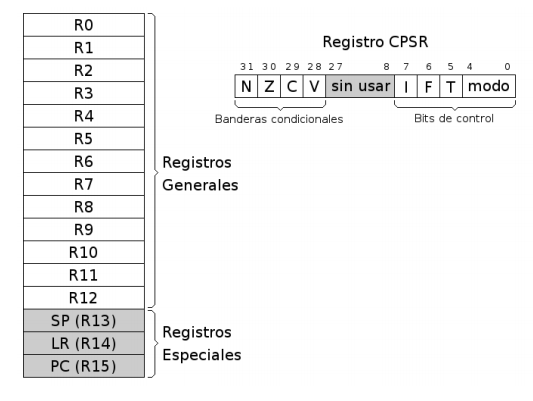
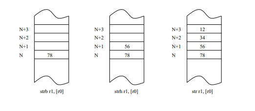
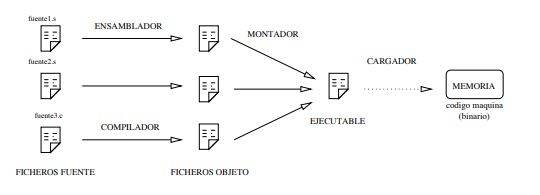
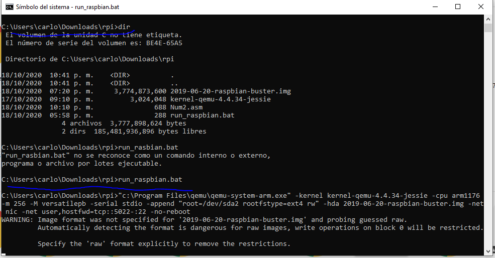
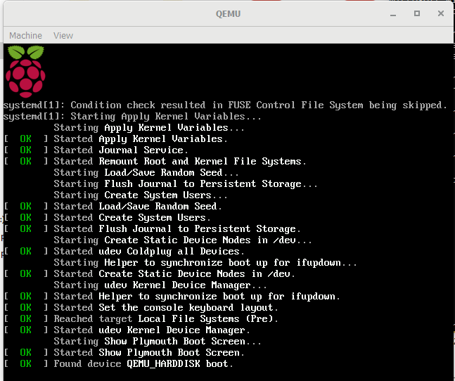
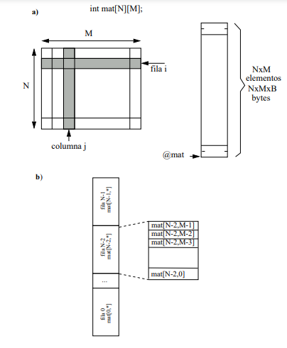

#    Tecnológico Nacional de México
#   Instituto Tecnológico de Tijuana
#        Subdirección Académica

# Departamento de Sistemas y Computación
# Ingeniería en Sistemas Computacionales
# Lenguajes de interfaz 

# Practica Bloque: 2.1 Lectura y ejercicios de ARM32 del ebook OpenSource 📝
# Objetivo: 


# Carlon Gerardo Carlos Armando
   

# Profesor:
# MC. René Solis Reyes
# Semestre sep - ene 2020

-----


## Características generales de la arquitectura ARM
ARM es una arquitectura RISC (Reduced Instruction Set Computer=Ordenador
con Conjunto Reducido de Instrucciones) de 32 bits, salvo la versión del core ARMv8-
A que es mixta 32/64 bits (bus de 32 bits con registros de 64 bits). Se trata de una
arquitectura licenciable, quiere decir que la empresa desarrolladora ARM Holdings
diseña la arquitectura, pero son otras compañías las que fabrican y venden los chips,
llevándose ARM Holdings un pequeño porcentaje por la licencia.


El chip en concreto que lleva la Raspberry Pi es el BCM2835, se trata de un SoC
(System on a Chip=Sistema en un sólo chip) que contiene además de la CPU otros
elementos como un núcleo GPU (hardware acelerado OpenGL ES/OpenVG/Open
EGL/OpenMAX y decodificación H.264 por hardware) y un núcleo DSP (Digital
signal processing=Procesamiento digital de señales) que es un procesador más pequeño y simple que el principal, pero especializado en el procesado y representación
de señales analógicas. La CPU en cuestión es la ARM1176JZF-S, un chip de la
familia ARM11 que usa la arquitectura ARMv6k.
Registros
La arquitectura ARMv6 presenta un conjunto de 17 registros (16 principales más
uno de estado) de 32 bits cada uno.


## Registros
La arquitectura ARMv6 presenta un conjunto de 17 registros (16 principales más
uno de estado) de 32 bits cada uno.





**Registros Generales.** Su función es el almacenamiento temporal de datos. Son los
13 registros que van R0 hasta R12.


**Registros Especiales.** Son los últimos 3 registros principales: R13, R14 y R15.
Como son de propósito especial, tienen nombres alternativos.
- **SP**/R13. Stack Pointer ó Puntero de Pila. Sirve como puntero para almacenar variables locales y registros en llamadas a funciones.
- **LR**/R14. Link Register ó Registro de Enlace. Almacena la dirección de retorno cuando una instrucción BL ó BLX ejecuta una llamada a una rutina.
- **PC**/R15. Program Counter ó Contador de Programa. Es un registro que
indica la posición donde está el procesador en su secuencia de instrucciones. Se incrementa de 4 en 4 cada vez que se ejecuta una instrucción,
salvo que ésta provoque un salto.
**Registro CPSR.** Almacena las banderas condicionales y los bits de control. Los
bits de control definen la habilitación de interrupciones normales (I), interrupciones rápidas (F), modo Thumb 1
(T) y el modo de operación de la CPU.


**Esquema de almacenamiento**
El procesador es Bi-Endian, quiere decir que es configurable entre Big Endian y
Little Endian. Aunque nuestro sistema operativo nos lo limita a Little Endian.
Por tanto la regla que sigue es “el byte menos significativo ocupa la posición más
baja”.
La memoria siempre se referencia a nivel de byte, es decir si decimos la posición N nos estamos refiriendo al byte N-ésimo.





## El lenguaje ensamblador
El ensamblador es un lenguaje de bajo nivel que permite un control directo de la CPU y todos los elementos asociados. Cada línea de un programa ensamblador
consta de una instrucción del procesador y la posición que ocupan los datos de esa instrucción.
Desarrollar programas en lenguaje ensamblador es un proceso laborioso. El procedimiento es similar al de cualquier lenguaje compilado. Un conjunto de instrucciones
y/o datos forman un módulo fuente. Este módulo es la entrada del compilador, que chequea la sintaxis y lo traduce a código máquina formando un módulo objeto. Finalmente, un enlazador (montador ó linker) traduce todas las referencias relativas a direcciones absolutas y termina generando el ejecutable. El ensamblador presenta una serie de ventajas e inconvenientes con respecto a otros lenguajes de más alto nivel. Al ser un lenguaje de bajo nivel, presenta como principal característica la flexibilidad y la posibilidad de acceso directo a nivel de registro. En contrapartida, programar en ensamblador es laborioso puesto que los programas contienen un número elevado de líneas y la corrección y depuración de éstos se hace difícil.
Generalmente, y dado que crear programas un poco extensos es laborioso, el
ensamblador se utiliza como apoyo a otros lenguajes de alto nivel para 3 tipos de
situaciones:
- Operaciones que se repitan un número elevado de veces.
- Cuando se requiera una gran velocidad de proceso.
- Para utilización y aprovechamiento de dispositivos y recursos del sistema.


### El entorno
Los pasos habituales para hacer un programa son los siguientes: lo primero es escribir el programa en el lenguaje fuente mediante un editor de programas. El resultado es un fichero en un lenguaje que puede entender el usuario, pero no la máquina. Para traducirlo a lenguaje máquina hay que utilizar un programa traductor. Éste genera un fichero con la traducción de dicho programa, pero todavía no es un programa ejecutable. Un fichero ejecutable contiene el programa traducido más una serie de códigos que debe tener todo programa que vaya a ser ejecutado en una máquina determinada. Entre estos códigos comunes se encuentran las librerías del lenguaje. El encargado de unir el código del programa con el código de estas librerías es un programa llamado montador (linker) que genera el programa
ejecutable.





### Aspecto de un programa en ensamblador
La principal característica de un módulo fuente en ensamblador es que existe
una clara separación entre las instrucciones y los datos. La estructura más general
de un módulo fuente es:
- **Sección de datos.** Viene identificada por la directiva .data. En esta zona se
definen todas las variables que utiliza el programa con el objeto de reservar
memoria para contener los valores asignados. Hay que tener especial cuidado
para que los datos estén alineados en palabras de 4 bytes, sobre todo después
de las cadenas. Los datos son modificables.
- **Sección de código.** Se indica con la directiva .text, y sólo puede contener código
o datos no modificables. Como todas las instrucciones son de 32 bits no hay
que tener especial cuidado en que estén alineadas. Si tratamos de escribir en
esta zona el ensamblador nos mostrará un mensaje de error.


Un módulo fuente, como el del ejemplo, está formado por instrucciones, datos,
símbolos y directivas. Las instrucciones son representaciones nemotécnicas del juego
de instrucciones del procesador. Un dato es una entidad que aporta un valor numérico, que puede expresarse en distintas bases o incluso a través de una cadena.
Los símbolos son representaciones abstractas que el ensamblador maneja en tiempo
de ensamblado pero que en el código binario resultante tendrá un valor numérico
concreto. Hay tres tipos de símbolos: las etiquetas, las macros y las constantes simbólicas. Por último tenemos las directivas, que sirven para indicarle ciertas cosas
al ensamblador, como delimitar secciones, insertar datos, crear macros, constantes
simbólicas, etc... Las instrucciones se aplican en tiempo de ejecución mientras que
las directivas se aplican en tiempo de ensamblado.


### Datos
Los datos se pueden representar de distintas maneras. Para representar números
tenemos 4 bases. La más habitual es en su forma decimal, la cual no lleva ningún
delimitador especial. Luego tenemos otra muy útil que es la representación hexadecimal, que indicaremos con el prefijo 0x. Otra interesante es la binaria, que emplea
el prefijo 0b antes del número en binario. La cuarta y última base es la octal, que usaremos en raras ocasiones y se especifica con el prefijo 0. Sí, un cero a la izquierda
de cualquier valor convierte en octal dicho número. Todas estas bases pueden ir con un signo menos delante, codificando el valor negativo en complemento a dos. Para representar carácteres y cadenas emplearemos las comillas simples y las comillas dobles respectivamente.


### Símbolos
Como las etiquetas se pueden ubicar tanto en la sección de datos como en la de
código, la versatilidad que nos dan las mismas es enorme. En la zona de datos, las
etiquetas pueden representar variables, constantes y cadenas. En la zona de código
podemos usar etiquetas de salto, funciones y punteros a zona de datos.
Las macros y las constantes simbólicas son símbolos cuyo ámbito pertenece al
preprocesador, a diferencia de las etiquetas que pertenecen al del ensamblador. Se
especifican con las directivas .macro y .equ respectivamente y permiten que el código
sea más legible y menos repetitivo.


### Instrucciones
Las instrucciones del as responden al formato general:

```bash
Etiqueta : Nemot é cnico Operando / s /* Comentario */
```

De estos campos, sólo el nemónico (nombre de la instrucción) es obligatorio. En
la sintaxis del as cada instrucción ocupa una línea terminando preferiblemente con
el ASCII 10 (LF), aunque son aceptadas las 4 combinaciones: CR, LF, CR LF y LF
CR. Los campos se separan entre sí por al menos un carácter espacio (ASCII 32) o
un tabulador y no existe distinción entre mayúsculas y minúsculas.

Cada instrucción del **as** se refiere a una operación que puede realizar el microprocesador. También hay pseudoinstrucciones que son tratadas por el preprocesador
como si fueran macros y codifican otras instrucciones, como lsl rn, #x que codifica
mov rn, rn, lsl #x, o bien push/pop que se traducen instrucciones stm/ldm más
complejas y difíciles de recordar para el programador. Podemos agrupar el conjunto
de instrucciones del as, según el tipo de función que realice el microprocesador, en
las siguientes categorías:
- Instrucciones de transferencia de datos Mueven información entre registros
y posiciones de memoria. En la arquitectura ARMv6 no existen puertos ya
que la E/S está mapeada en memoria. Pertenecen a este grupo las siguientes
instrucciones: **mov, ldr, str, ldm, stm, push, pop.**
- Instrucciones aritméticas. Realizan operaciones aritméticas sobre números binarios o BCD. Son instrucciones de este grupo **add, cmp, adc, sbc, mul.**
- Instrucciones de manejo de bits. Realizan operaciones de desplazamiento, rotación y lógicas sobre registros o posiciones de memoria. Están en este grupo
las instrucciones: **and, tst, eor, orr, LSL, LSR, ASR, ROR, RRX.**
- Instrucciones de transferencia de control. Se utilizan para controlar el flujo de
ejecución de las instrucciones del programa. Tales como **b, bl, bx, blx** y sus
variantes condicionales.


### Directivas
Las directivas son expresiones que aparecen en el módulo fuente e indican al
compilador que realice determinadas tareas en el proceso de compilación. Son fácilmente distinguibles de las instrucciones porque siempre comienzan con un punto.
El uso de directivas es aplicable sólo al entorno del compilador, por tanto varían
de un compilador a otro y para diferentes versiones de un mismo compilador. Las
directivas más frecuentes en el as son:
- *Directivas de asignación:* Se utilizan para dar valores a las constantes o reservar
posiciones de memoria para las variables (con un posible valor inicial). **.byte,
.hword, .word, .ascii, .asciz, .zero y .space** son directivas que indican
al compilador que reserve memoria para las variables del tipo indicado.
- *Directivas de control:* **.text y .data** sirven para delimitar las distintas secciones de nuestro módulo. **.align alineamiento** es para alinear el siguiente dato,
rellenando con ceros, de tal forma que comience en una dirección múltiplos
del número que especifiquemos en alineamiento, normalmente potencia de 2.
- *Directivas de operando:* Se aplican a los datos en tiempo de compilación. En
general, incluyen las operaciones lógicas &, |, ∼, aritméticas +, -, *, /, % y de
desplazamiento <, >, <<, >>
- *Directivas de Macros:* Una *.macro* es un conjunto de sentencias en ensamblador
(directivas e instrucciones) que pueden aparecer varias veces repetidas en un programa con algunas modificaciones (opcionales). 
No hay que confundir las macros con los procedimientos. Por un lado, el código
de un procedimiento es único, todas las llamadas usan el mismo, mientras que
el de una macro aparece (se expande) cada vez que se referencia, por lo que
ocuparán más memoria. Las macros serán más rápidas en su ejecución, pues
es secuencial, frente a los procedimientos, ya que implican un salto cuando
aparece la llamada y un retorno cuando se termina. La decisión de usar una
macro o un procedimiento dependerá de cada situación en concreto, aunque
las macros son muy flexibles (ofrecen muchísimas más posibilidades de las
comentadas aquí). Esta posibilidad será explotada en sesiones más avanzadas.


### Ensamblar y linkar un programa
La traducción o ensamblado de un módulo fuente (nombreprograma.s) se realiza con el programa Gnu Assembler, con el siguiente comando:
- *as -o nombreprograma.o nombreprograma.s*
NOTA: tanto el comando as como el nombre del programa son sensibles a las
mayúsculas. Por tanto el comando debe ir en minúsculas y el nombre como queramos,
pero recomendamos minúsculas también. Las opción **-o nombreprograma.o** puede
ir después de **nombreprograma.s.**
El **as** genera un fichero nombreprograma.o.
Para montar (linkar) hay que hacer:
- *gcc -o nombreprograma nombreprograma.o*
NOTA: Nuevamente, tanto **gcc** como el nombre del programa deben estar en
minúsculas. Este comando es muy parecido al anterior, podemos poner si queremos
**-o nombreprograma** detrás de **nombreprograma.o**. La única diferencia es que
el archivo no tiene extensión, que por otro lado es una práctica muy recomendable
para ejecutables en Linux.
Una vez hecho ésto, ya tenemos un fichero ejecutable (nombreprograma) que
podemos ejecutar o depurar con el **gdb**.

## Ejecucion Raspberry Pi 





Una vez que tenemos todo instalado ingresamos a la carpeta donde guardamos todo por medio del cmd, confirmamos con dir, y por ultimo ingresamos el comando *run_raspbian.bat*





Se abrira la pantalla del raspberry pi, despues nos pedira la contrasena y el usuario.


Una vez ingresado podemos entrar a nuestro Raspberry pi.


## Modos de direccionamiento del ARM
En la arquitectura ARM los accesos a memoria se hacen mediante instrucciones
específicas ldr y str. El resto de instrucciones toman operandos desde registros o valores inmediatos, sin excepciones. En este caso la arquitectura nos fuerza a que trabajemos de un modo determinado: primero cargamos los registros desde memoria, luego procesamos el valor de estos registros con el amplio abanico de instrucciones del ARM,
para finalmente volcar los resultados desde registros a memoria. Existen otras arquitecturas como la Intel x86, donde las instrucciones de procesado nos permiten
leer o escribir directamente de memoria.
**Direccionamiento inmediato.** El operando fuente es una constante, formando
parte de la instrucción.
```bash
mov r0, # 1
add r2, r3, #4
```
**Direccionamiento inmediato con desplazamiento o rotación.** Es una variante del anterior en la cual se permiten operaciones intermedias sobre los registros.
m
```bash
mov r1, r2, LSL #1 /* r1 <- (r2*2) */
mov r1, r2, LSL #2 /* r1 <- (r2*4) */
mov r1, r3, ASR #3 /* r1 <- (r3/8) */
```
Estas instrucciones también se usan implicitamente para la creación de constantes, rotando o desplazando constantes más pequeñas de forma transparente
al usuario. Como todas las instrucciones ocupan 32 bits, es técnicamente imposible que podamos cargar en un registro cualquier constante de 32 bits con
la instrucción mov. Por esta razón cuando se necesita cargar una constante
más compleja en un registro (como una dirección a una variable de memoria)
no podemos hacerlo con la instrucción mov, tenemos que recurrir a ldr con
direccionamiento a memoria.
**Direccionamiento a memoria, sin actualizar registro puntero.** Es la forma
más sencilla y admite 4 variantes. Después del acceso a memoria ningún registro implicado en el cálculo de la dirección se modifica.
- [Rx, #+inmediato], [Rx, #-inmediato]
Simplemente añade (o sustrae) un valor inmediato al registro dado para
calcular la dirección. Es muy útil para acceder a elementos fijos de un
array, ya que el desplazamiento es constante.

- [Rx, +Ry], [Rx, -Ry]
Parecido al anterior pero en lugar de un inmediato emplea otro registro.
Útil en el caso de queramos mantener fijo el registro Rx y movernos con Ry, o bien para acceder a desplazamientos mayores a 4095.

- [Rx, +Ry, operación_desp #inmediato], [Rx, -Ry, operación_desp #inmediato]
En este caso aplicamos una operación de desplazamiento o rotación sobre
el segundo registro Ry. Muy útil en caso de arrays o estructuras con elementos de longitud potencia de 2, ya que podemos indexar directamente.

**Direccionamiento a memoria, actualizando registro puntero.** En este modo
de direccionamiento, el registro que genera la dirección se actualiza con la propia dirección. De esta forma podemos recorrer un array con un sólo registro
sin necesidad de hacer el incremento del puntero en una instrucción aparte.
Hay dos métodos de actualizar dicho registro, antes de ejecutar la instrucción
(preindexado) o después de la misma (postindexado). Los tres siguientes tipos
son los postindexados.
- [Rx], #+inmediato, [Rx], #-inmediato
Una notación muy parecida a la versión que no actualiza registro, la
única diferencia es que la constante de desplazamiento queda fuera de
los corchetes. Presenta el mismo límite de hasta 4095.

- [Rx], +Ry, [Rx], -Ry
Igual que antes pero con registro en lugar de inmediato.

- [Rx], +Ry, operación_desp #inmediato, [Rx], -Ry, operación_desp #inmediato
Nótese que en todos los modos postindexados encerramos entre llaves
el primer registro, que es el que se va a utilizar en la instrucción de
lectura o escritura en memoria. Es decir primero cargamos de [Rx] y
luego actualizamos Rx con el valor que corresponda.

Ya hemos visto la notación postindexada. Veamos ahora los tres modos
preindexados.
- [Rx, #+inmediato]!, [Rx, #-inmediato]!
La idea en todos los casos es encerrar entre corchetes la dirección que se
va a usar en la instrucción. Para diferenciarlo del caso que no actualiza
el registro le añadimos un **!** al final.
Este modo es muy útil en casos que queramos reusar en una futura
instrucción la dirección que hemos calculado. 

- [Rx, +Ry]!, [Rx, -Ry]!
Similar al anterior pero usando Ry en lugar de inmediato.
- [Rx, +Ry, operación_desp #inmediato]!, [Rx, -Ry, operación_desp #inmediato]!
Tercer y último caso de direccionamiento preindexado.

### Tipos de datos
**Punteros.** Un **puntero** siempre ocupa 32 bits y contiene una dirección de memoria.
En ensamblador no tienen tanta utilidad como en C, ya que disponemos de registros
de sobra y es más costoso acceder a las variables a través de los punteros que directamente.

**Vectores.** Todos los elementos de un vector se almacenan en un único bloque de
memoria a partir de una dirección determinada. Los diferentes elementos se almacenan en posiciones consecutivas, de manera que el elemento i está entre los i-1 e
i+1 (figura 2.1). Los vectores están definidos siempre a partir de la posición 0. El
propio índice indica cuántos elementos hemos de desplazarnos respecto del comienzo
del primer elemento (para acceder al elemento cero hemos de saltarnos 0 elementos,
para acceder al elemento 1 hemos de saltarnos un elemento, etc...; En general, para
acceder al elemento con índice i hemos de saltarnos los i elementos anteriores).

**Matrices bidimensionales.** Una matriz bidimensional de N×M elementos se almacena en un único bloque de memoria. Interpretaremos una matriz de N×M como
una matriz con N filas de M elementos cada una. Si cada elemento de la matriz
ocupa B bytes, la matriz ocupará un bloque de M ×N ×B bytes.
Dentro de este bloque, los elementos se almacenan por filas. Primero se guardan
todos los elementos de la fila 0, después todos los de la fila 1, etc.

## Instrucciones de salto
Las instrucciones de salto pueden producir saltos incondicionales (b y bx) o
saltos condicionales. Cuando saltamos a una etiqueta empleamos b, mientras que
si queremos saltar a un registro lo hacemos con bx. La variante de registro bx la
solemos usar como instrucción de retorno de subrutina, raramente tiene otros usos.
En los saltos condicionales añadimos dos o tres letras a la (b/bx), mediante las
cuales condicionamos si se salta o no dependiendo del estado de los flags. Estas
condiciones se pueden añadir a cualquier otra instrucción, aunque la mayoría de las
veces lo que nos interesa es controlar el flujo del programa y así ejecutar o no un
grupo de instrucciones dependiendo del resultado de una operación (reflejado en los
flags).
La lista completa de condiciones es ésta:
- EQ (equal, igual). Cuando Z está activo (Z vale 1).
- NEQ (not equal, igual). Cuando Z está inactivo (Z vale 0).
- MI (minus, negativo). Cuando N está activo (N vale 1).
- PL (plus, positivo o cero). Cuando N está inactivo (N vale 0).
- CS/HS (carry set/higher or same, carry activo/mayor o igual). Cuando C está activo (C vale 1).
- CC/LO (carry clear/lower, carry inactivo/menor). Cuando C está inactivo (C vale 0).
- VS (overlow set, desbordamiento activo). Cuando V está activo (V vale 1).
- VC (overlow clear, desbordamiento inactivo). Cuando V está inactivo (V vale 0).
- GT (greater than, mayor en complemento a dos). Cuando Z está inactivo y N=V (Z vale 0, N vale V).
- LT (lower than, menor en complemento a dos). Cuando N!=V (N vale not V).
- GE (greater or equal, mayor o igual en complemento a dos). Cuando N=V (N vale V).
- LE (lower or equal, menor o igual en complemento a dos). Cuando Z está activo y N!=V (Z vale 1, N vale not V).
- HI (higher, mayor). Cuando C está activo y Z inactivo (C vale 1, Z vale 0).
- LS (lower or same, menor o igual). Cuando C está inactivo ó Z activo (C vale 0 ó Z vale 1).

Las instrucciones de salto en la arquitectura ARM abarcan una zona muy extensa, hasta 64 Mb (32 Mb hacia adelante y otros 32 Mb hacia atrás). Estos límites
podemos justificarlos atendiendo al formato de instrucción que podemos ver en el
apéndice A. El código de operación ocupa 8 de los 32 bits, dejándonos 24 bits para
codificar el destino del salto. En principio con 24 bits podemos direccionar 16 Mb
[−2^23 − 1, 2^23 − 1], sin embargo la arquitectura ARM se aprovecha del hecho de que
las instrucciones están alineadas a direcciones múltiplo de 4 (en binario acaban en
00), por lo que el rango real es de 64 Mb [−2^25 − 1, 2^25 − 1]
En caso de necesitar un salto mayor recurrimos a la misma solución de la carga
de inmediatos del mov, solo que el registro a cargar es el pc.


## Estructuras de control de alto nivel
Las estructuras for y while se pueden ejecutar un mínimo de 0 iteraciones (si
la primera vez no se cumple la condición). 
Para programar en ensamblador estas estructuras se utilizan instrucciones de
salto condicional. Previo a la instrucción de salto es necesario evaluar la condición
del bucle o de la sentencia if, mediante instrucciones aritméticas o lógicas, con el
fin de actualizar los flags de estado. 
```bash
int vi , vf , i ;
for ( i= vi ; i <= vf ; i ++ ){
/* Cuerpo del bucle */
}
i= vi ;
while ( i <= vf ){
/* Cuerpo del bucle */
i ++;
```
*Listado 2.1: Estructura del for y while en C (tipos1.c)*
```bash
ldr r1, = vi
ldr r1, [ r1 ]
ldr r2, = vf
ldr r2, [ r2 ]
bucle : cmp r1, r2
bhi salir
/* Cuerpo
del
bucle */
add r1, r1, # 1
b bucle
salir :
```
*Listado 2.2: Traducción de las estructuras for y while. Hemos supuesto que el valor
inicial está en la variable vi y el valor final en la variable vf y se ha utilizado el
registro r1 como índice de las iteraciones i.*


<a href="https://es.cooltext.com" target="_top">Cool Text: Generador de Logotipos y Gráficos.</a>
